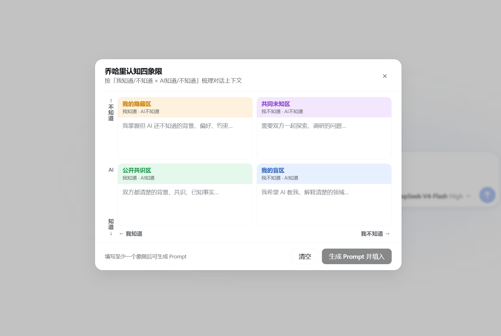
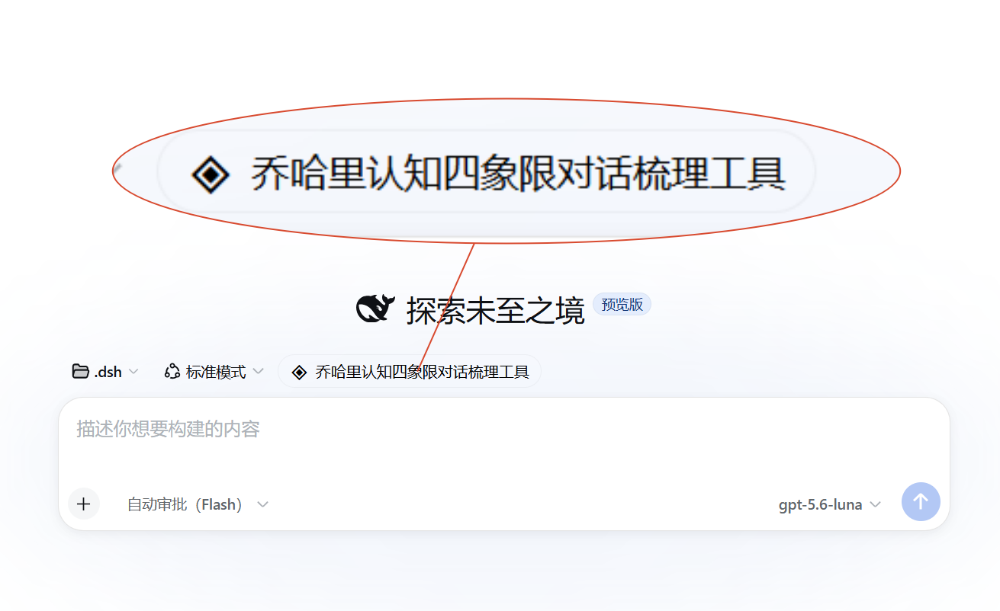

# dsh-johari-cognition-quadrant-dialog-composer

[](./README.md)

Johari cognition-quadrant dialog prompt composer — a DSH (DeepSeek Harness) Web UI plugin.

## Features

Adds a "Johari Quadrant" button above the conversation composer. Clicking it opens a 2×2 quadrant panel:

| Quadrant | Position | Meaning |
|----------|----------|---------|
| Hidden Area | Top-left | I know · AI doesn't — background info to tell AI |
| Unknown Area | Top-right | I don't know · AI doesn't — problems to explore together |
| Open Area | Bottom-left | I know · AI knows — shared consensus background |
| Blind Area | Bottom-right | I don't know · AI knows — areas where AI can teach me |

- **X-axis** (left → right): I know → I don't know
- **Y-axis** (bottom → top): AI knows → AI doesn't know

Fill in the quadrants and click "Generate Prompt" to compose a structured prompt and write it into the conversation input.

## Screenshots

### Quadrant Panel



### New Conversation Page



### Button in Conversation


## Installation

### Via dsh plugin add (Recommended)

```bash
dsh plugin add cyrus123456/dsh-johari-cognition-quadrant-dialog-composer
```

### Build from Source

```bash
git clone https://github.com/cyrus123456/dsh-johari-cognition-quadrant-dialog-composer.git
cd dsh-johari-cognition-quadrant-dialog-composer
pnpm install
pnpm run build
```

Build output:
- `lib/index.js` — Host side (Node)
- `lib/client.js` — Client side (browser, with CSS injection)

### Manual Registration to DSH Profile

1. Create a junction in `profiles/web/node_modules/` pointing to this plugin
2. Add `"dsh-johari-cognition-quadrant-dialog-composer"` to the `dsh.profile.bundles` array in `profiles/web/package.json`
3. Restart DSH

## Tech Stack

- TypeScript + React 18
- esbuild bundler (Node 20+ compatible)
- CSS runtime injection (`<style>` tag, `johari-` prefix isolation)
- DSH Plugin API (`conversation.input.dock` slot)

## File Structure

```
dsh-johari-cognition-quadrant-dialog-composer/
├── package.json
├── tsconfig.json
├── cordis.patch.yml          # DSH bundle patch
├── scripts/
│   └── build.mjs             # esbuild build script
├── src/
│   ├── index.ts              # Host entry
│   └── client/
│       ├── index.ts          # Client entry (slot registration + CSS injection)
│       ├── JohariDockEntry.tsx  # Button + modal React component
│       ├── johari.css        # Plugin styles (johari- prefix)
│       └── css.d.ts          # CSS text import type declaration
└── lib/                      # Build output (gitignored)
```
